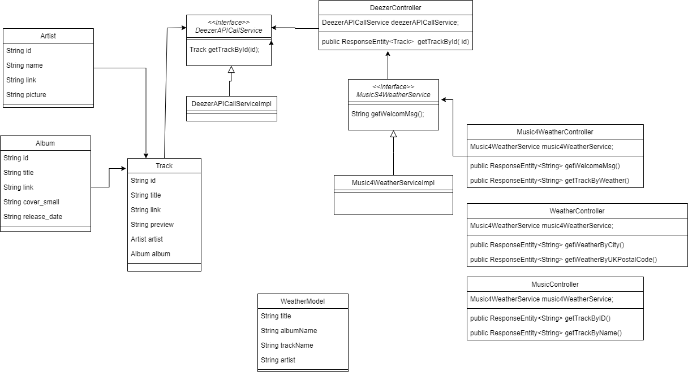

# Music for Weather API - group 5

## Introduction
An API application that takes the name of a city as input and provides a song recommendation based on the current weather conditions in that city.

## Pre-Requisities

- Java SE Development Kit 17
- Maven
- Deezer API https://rapidapi.com/deezerdevs/api/deezer-1
- Weather API - https://www.weatherapi.com/docs/

## Technology & Dependencies

- Spring Boot
- Spring Web
- Lombok
- openjfx
- junit

## UML diagram

## Features

## Endpoints
| Number | Endpoint                                   | Description                                |
|--------|--------------------------------------------|--------------------------------------------|
| 1      | GET /api/v1/music4Weather                  | Welcome to Music for Weather API           |
| 2      | GET /api/v1/music4Weather/getWeatherByCity | input : city output : Weather info         |
| 3      | GET /api/v1/music4Weather/getTrackByName   | intput : name output : music track preview |
| 4      | GET /api/v1/music4Weather/getTrackBaseOnWeather | input : city output : random one track preview call getWeatherByCity then getTrachByName |

## Test result

## Future thoughts
